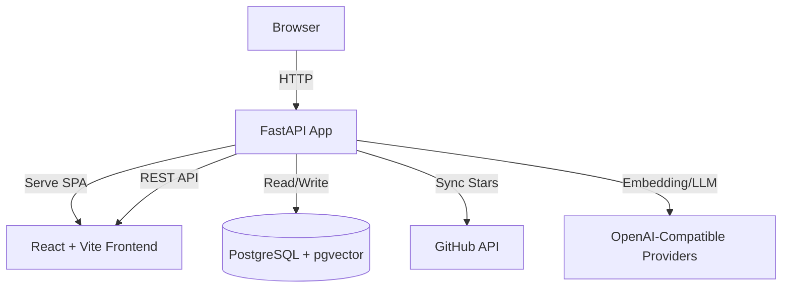

<div align="center">
  <a href="https://github.com/Tendo33/MyNebula">
    
  </a>
  <h1>MyNebula</h1>

  <p>
    <strong>Transform your GitHub Stars into a semantic knowledge nebula.</strong>
  </p>

  <p>
    Turn a long list of starred repositories into an explorable personal knowledge graph.
  </p>

  <p>
    English | <a href="README.zh.md">中文</a>
  </p>

  <p>
    <a href="#-quick-start">Quick Start</a> ·
    <a href="#-local-development">Local Development</a> ·
    <a href="#-docs-index">Docs Index</a> ·
    <a href="#-faq">FAQ</a>
  </p>

  <p>
    <a href="https://www.python.org/downloads/"></a>
    <a href="https://fastapi.tiangolo.com/"></a>
    <a href="https://www.postgresql.org/"></a>
    <a href="https://github.com/astral-sh/uv"></a>
    <a href="https://github.com/astral-sh/ruff"></a>
    <a href="LICENSE"></a>
  </p>
</div>

<div align="center">
  
</div>

---

## Why MyNebula

When your GitHub Stars keep growing, it becomes hard to:

- quickly find what you saved,
- discover related projects,
- understand how your interests evolved over time.

MyNebula turns a star list into a knowledge space. Instead of only searching by keyword, you can explore semantic relationships, clusters, and timeline trends.

## ✨ Highlights

- **Semantic Graph**: Builds repository relationships from embedding similarity and visualizes them as clusters.
- **Multi-dimensional Filtering**: Filter by clusters, star lists, time range, and text search.
- **AI Enrichment**: Generates summaries and tags to make unfamiliar projects easier to scan.
- **Timeline Playback**: Revisit your starred activity by month.
- **Sync + Schedule**: Supports incremental sync, full refresh, and scheduled tasks.
- **Operations-ready Settings**: Manage clustering parameters, sync status, and runtime settings in one place.

## 📸 Screenshots

<div align="center">
  
  <br /><br />
  
</div>

---

## 🏗 Architecture



- Backend: FastAPI + SQLAlchemy + asyncpg + APScheduler
- Frontend: React + TypeScript + Vite + Tailwind
- Data: PostgreSQL 16 + pgvector
- AI providers: SiliconFlow / OpenAI / Jina / Ollama (OpenAI-compatible APIs)

---

## 🚀 Quick Start

### Option A: Docker Compose (Recommended)

Use this for the fastest setup.

```bash
git clone https://github.com/Tendo33/MyNebula.git
cd MyNebula

cp .env.example .env
# Edit .env and set at least: GITHUB_TOKEN, EMBEDDING_API_KEY

docker compose up -d
```

Default endpoints:

- Web: <http://localhost:8000>
- Health check: <http://localhost:8000/health>

> `/docs` and `/redoc` are available only when `DEBUG=true`.

---

## 💻 Local Development

### Requirements

- Python 3.12+
- Node.js 20+
- Docker (for local PostgreSQL)

### 1) Prepare environment

```bash
cp .env.example .env
```

### 2) Start database

```bash
docker compose up -d db
```

### 3) Start backend

```bash
uv sync
uv run alembic upgrade head
uv run uvicorn nebula.main:app --reload --port 8000
```

### 4) Start frontend (optional)

If you want frontend hot-reload on port 5173:

```bash
npm --prefix frontend install
VITE_API_BASE_URL=http://localhost:8000 npm --prefix frontend run dev
```

If you prefer backend-served static frontend:

```bash
npm --prefix frontend run build
# then open http://localhost:8000
```

---

## ⚙️ Key Configuration

For full details, see `.env.example` and `doc/ENV_VARS.md`.

| Category | Variable | Description |
|---|---|---|
| GitHub | `GITHUB_TOKEN` | Required for star sync and list sync |
| Embedding | `EMBEDDING_API_KEY` | Required for vector embeddings |
| LLM | `LLM_API_KEY` | Optional, recommended for summaries/cluster naming |
| Admin | `ADMIN_USERNAME` / `ADMIN_PASSWORD` | Admin access for settings and mutating operations |
| Server | `API_PORT` | Public service port (default: 8000) |
| App | `DEBUG` | Enables `/docs` and debug behavior |

---

## 🧭 Common Operations

- **Initial import**: open `/settings`, sign in as admin, and run star sync.
- **Re-cluster**: adjust `max_clusters/min_clusters` in settings, then run re-clustering.
- **Full refresh**: reprocesses all repositories (time-consuming, uses API quota).
- **Health check**: use `/health` to verify app and DB status.

---

## 🗂 Project Structure

```text
MyNebula/
├── src/nebula/              # FastAPI app and backend logic
│   ├── api/                 # API routes
│   ├── core/                # config, AI, clustering, scheduler
│   ├── db/                  # ORM models and DB setup
│   └── schemas/             # Pydantic schemas
├── frontend/                # React frontend
├── alembic/                 # database migrations
├── tests/                   # Python tests
├── doc/                     # detailed docs and images
├── docker-compose.yml
└── .env.example
```

---

## 🧪 Development Quality

```bash
# Python format and lint
uv run ruff format
uv run ruff check --fix

# Backend tests
uv run pytest

# Frontend build verification
npm --prefix frontend run build
```

---

## 🛣 Roadmap (Suggested)

- Better combined filters (tags + time + star ranges)
- Explainable graph relations (why two repos are connected)
- Stronger export capabilities (lists/reports/graph snapshots)

---

## ❓ FAQ

### 1) The app opens but no data appears.

Check the following:

- `.env` contains a valid `GITHUB_TOKEN`.
- You have run sync from `/settings`.
- `/health` returns `database: connected`.

### 2) Why is `/docs` unavailable?

`/docs` is enabled only when `DEBUG=true`.

### 3) Frontend dev mode cannot reach backend API.

Start frontend with explicit API base URL:

```bash
VITE_API_BASE_URL=http://localhost:8000 npm --prefix frontend run dev
```

---

## 📚 Docs Index

- Docker deployment: `doc/DOCKER_DEPLOY.md`
- Environment variables: `doc/ENV_VARS.md`
- Model guide: `doc/MODELS_GUIDE.md`
- SDK usage: `doc/SDK_USAGE.md`
- Data reset guide: `doc/RESET_GUIDE.md`

---

## 🤝 Contributing & License

- Issues and PRs are welcome (see `CONTRIBUTING.md`).
- License: [MIT](LICENSE)

If this project helps you, a star is appreciated. ⭐
