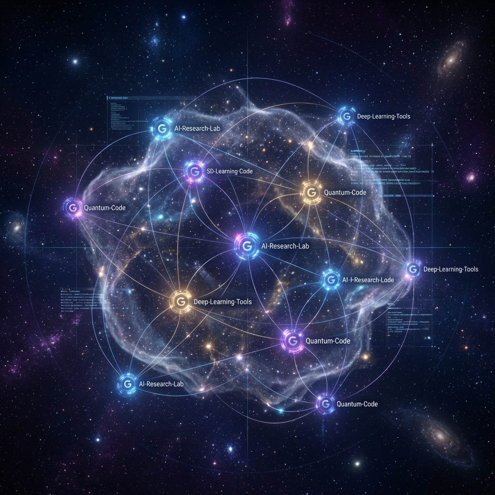

<div align="center">
  
  <h1>MyNebula (我的星云)</h1>
</div>

[](https://www.python.org/downloads/)
[](https://fastapi.tiangolo.com/)
[](https://www.postgresql.org/)
[](https://github.com/astral-sh/uv)
[](https://github.com/astral-sh/ruff)

**Transform your GitHub Stars into a semantic knowledge nebula.**

MyNebula 是一个现代化的 GitHub 星标管理与探索工具。它通过语义分析技术，将你浩如烟海的 GitHub Star 转化为一个直观的 2D 知识图谱。相似的项目会自动聚集，配合时间轴展示，让你对自己的技术栈演变一目了然。



## ✨ 主要特性

- 🌐 **知识星云 (Nebula Graph)**: 基于力导图的可视化，通过语义相似度自动将项目聚类。
- 🔍 **语义搜索 (Semantic Search)**: 支持自然语言查询，如 "找一个轻量级的 Go 语言 Web 框架"。
- 🤖 **AI 智能增强**:
  - **自动摘要**: 使用 LLM 为每个仓库生成精准的一句话总结。
  - **智能聚类**: 自动为不同的技术领域命名并分类。
- ⏰ **时间之旅 (Time Travel)**: 交互式时间轴，观察不同时期的关注重点与技术进化。
- 🐳 **一体化部署**: 采用现代化架构，FastAPI 直接托管前端，支持 Docker Compose 一键启动。
- 🔌 **高适配性**: 支持 SiliconFlow (推荐), OpenAI, Jina, Ollama 等多种 Embedding 提供商。

---

## 🚀 快速开始

### 方案 A：Docker Compose (推荐)

一键部署完整应用栈（包含数据库、后端与预构建的前端），无需手动建表：

```bash
# 1. 克隆仓库 (或只下载 docker-compose.yml + .env.example)
git clone https://github.com/yourusername/mynebula.git
cd mynebula

# 2. 配置环境变量
cp .env.example .env
# 编辑 .env 文件，务必填写 GITHUB_TOKEN、EMBEDDING_API_KEY、LLM_API_KEY

# 3. 启动所有服务 (自动拉取镜像、创建数据库和表)
docker compose up -d
```

访问：
- **Web 界面**: [http://localhost:8000](http://localhost:8000) (端口由 `API_PORT` 配置)
- **API 文档**: [http://localhost:8000/docs](http://localhost:8000/docs) (需 `DEBUG=true`)

> 详细部署文档请查阅 [Docker 部署指南](doc/DOCKER_DEPLOY.md)。

### 方案 B：本地开发模式

#### 环境要求
- Python 3.12+
- Node.js 20+ (仅用于修改前端)
- Docker (用于运行 PostgreSQL)

#### 1. 安装依赖
```bash
# 安装 uv (Python 包管理器)
pip install uv

# 安装后端依赖
uv sync

# 安装前端依赖 (如需开发)
cd frontend && npm install && cd ..
```

#### 2. 启动基础服务
```bash
# 启动数据库 (pgvector)
docker-compose up -d db

# 初始化数据库
uv run alembic upgrade head
```

#### 3. 启动应用
后端启动后将自动提供 API 并在 `http://localhost:8000` 服务前端静态文件：
```bash
# 启动后端 (包含静态前端服务)
uv run uvicorn nebula.main:app --reload --port 8000
```

---

## 🏗 技术架构

MyNebula 采用轻量化的一体化架构，降低了部署和维护成本：

```
┌─────────────────────────────────────────────────────────────┐
│                      MyNebula Integrated Architecture        │
├─────────────────────────────────────────────────────────────┤
│  ┌──────────────────┐           ┌───────────────────────┐   │
│  │  React Frontend  │  Static   │    FastAPI Server     │   │
│  │  (Built Assets)  │◄─────────►│  (API + SPA Hosting)  │   │
│  └──────────────────┘           └──────────┬────────────┘   │
│                                            │                │
│             ┌──────────────────────────────┼──────────────┐ │
│             ▼                              ▼              ▼ │
│  ┌────────────────────┐          ┌──────────────┐  ┌──────────┐│
│  │  PostgreSQL 16     │          │  GitHub API  │  │ LLM/Embed││
│  │  + pgvector        │          │              │  │ Provider ││
│  └────────────────────┘          └──────────────┘  └──────────┘│
└─────────────────────────────────────────────────────────────┘
```

- **Backend**: Python 3.12, FastAPI, SQLAlchemy (Async), Pydantic v2.
- **Frontend**: React 18, TypeScript, Vite, TailwindCSS, D3.js.
- **Analysis**: UMAP (降维), HDBSCAN (聚类).
- **Tooling**: `uv` (包管理), `ruff` (Lint/Format), `alembic` (数据库迁移).

---

## 🔧 开发与进阶

### 环境变量参考
详细配置请查阅 [.env.example](.env.example)。支持动态调整 Embedding Provider (SiliconFlow, OpenAI 等)。

| 类别 | 变量名 | 说明 |
|------|--------|------|
| **GitHub** | `GITHUB_TOKEN` | 必填，用于获取 Stars |
| **AI** | `EMBEDDING_API_KEY` | 必填，用于向量计算 |
| **AI** | `LLM_API_KEY` | 可选，用于生成摘要 (推荐设置) |
| **Server** | `API_PORT` | 外部访问端口 (默认 8000) |

### 代码质量控制
```bash
# 格式化
uv run ruff format
# 检查
uv run ruff check --fix
```

---

## 🛣 项目路线图

- [x] **Phase 1**: 基础框架与 pgvector 适配
- [x] **Phase 2**: 自动化数据同步管道 (README 获取 -> Embedding)
- [x] **Phase 3**: 智能聚类与 LLM 摘要增强
- [x] **Phase 4**: 响应式 2D 可视化界面与时间轴
- [x] **Phase 5**: 前后端整合部署方案
- [ ] **Phase 6**: 多用户/多账号支持
- [ ] **Phase 7**: 技术栈演化报告生成

## 🤝 贡献说明
欢迎提交 Pull Request 或 Issue！参与开发前请阅读 [CONTRIBUTING.md](CONTRIBUTING.md)。

## 📄 开源协议
本项目采用 [MIT License](LICENSE) 开源协议。

## 🙏 鸣谢
- [pgvector](https://github.com/pgvector/pgvector) - 开源 PostgreSQL 向量插件
- [D3.js](https://d3js.org/) - 强大的数据可视化库
- [SiliconFlow](https://siliconflow.cn/) - 提供高效的 Embedding 与 LLM 算力支持
