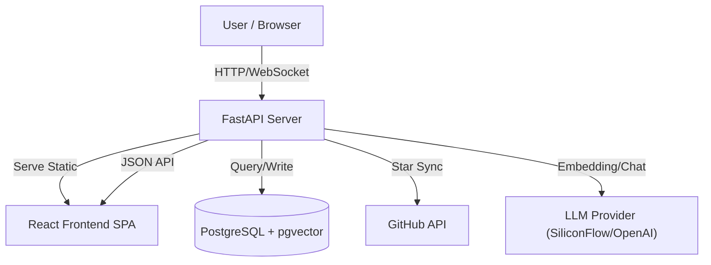

<div align="center">
  <a href="https://github.com/Tendo33/MyNebula">
    
  </a>
  <h1>MyNebula (我的星云)</h1>

  <p align="center">
    <strong>Transform your GitHub Stars into a semantic knowledge nebula.</strong>
  </p>

  [](https://www.python.org/downloads/)
  [](https://fastapi.tiangolo.com/)
  [](https://www.postgresql.org/)
  [](https://github.com/astral-sh/uv)
  [](https://github.com/astral-sh/ruff)
  [](LICENSE)
</div>

<br />

<div align="center">
  
</div>

<br />

MyNebula 是一个现代化的 GitHub 星标管理与探索工具。它通过语义分析技术，将你浩如烟海的 GitHub Star 转化为一个直观的 2D 知识图谱。相似的项目会自动聚集，配合时间轴展示，让你对自己的技术栈演变一目了然。

## 📖 目录

- [📖 目录](#-目录)
- [✨ 主要特性](#-主要特性)
- [📸 界面预览](#-界面预览)
- [🏗 技术架构](#-技术架构)
  - [Tech Stack](#tech-stack)
- [🚀 快速开始](#-快速开始)
  - [🐳 方案 A：Docker Compose (推荐)](#-方案-adocker-compose-推荐)
  - [💻 方案 B：本地开发](#-方案-b本地开发)
    - [环境要求](#环境要求)
    - [1. 安装依赖](#1-安装依赖)
    - [2. 启动服务](#2-启动服务)
- [🔧 开发配置](#-开发配置)
  - [代码质量](#代码质量)

---

## ✨ 主要特性

| 功能 | 描述 |
| :--- | :--- |
| **🌐 知识星云** | 基于力导图的可视化 (D3.js)，通过语义相似度自动将项目聚类，发现潜在关联。 |
| **🔍 语义搜索** | 支持自然语言查询，如 "找一个轻量级的 Go 语言 Web 框架"，告别关键词匹配。 |
| **🤖 AI 智能增强** | 利用 LLM 生成精准的一句话总结，并自动为不同的技术领域命名分类。 |
| **⏰ 时间之旅** | 交互式时间轴，观察不同时期的关注重点与技术进化，回溯你的技术成长之路。 |
| **🐳 一体化部署** | 采用现代化架构，FastAPI 直接托管前端，支持 Docker Compose 一键启动。 |
| **🔌 高适配性** | 支持 **SiliconFlow** (推荐), OpenAI, Jina, Ollama 等多种 Embedding 提供商。 |

## 📸 界面预览

<div align="center">
  
  <br />
  <br />
  
  <br />
  <p>点击 /graph 页面右上角的 <b>同步星标</b> 按钮，MyNebula 将自动开始同步你的 GitHub Star。</p>
</div>

---

## 🏗 技术架构

MyNebula 采用轻量化的一体化架构，降低了部署和维护成本。

### Tech Stack



---

## 🚀 快速开始

### 🐳 方案 A：Docker Compose (推荐)

最简单的部署方式，包含数据库、后端与预构建的前端。

```bash
# 1. 克隆仓库
git clone https://github.com/Tendo33/MyNebula.git
cd MyNebula

# 2. 配置环境变量
cp .env.example .env
# ⚠️ 编辑 .env，填入 GITHUB_TOKEN, EMBEDDING_API_KEY

# 3. 启动所有服务
docker compose up -d
```

- **Web 界面**: [http://localhost:8000](http://localhost:8000)
- **API 文档**: [http://localhost:8000/docs](http://localhost:8000/docs)

> 详细文档见 [Docker 部署指南](doc/DOCKER_DEPLOY.md)。

### 💻 方案 B：本地开发

适合贡献代码或二次开发。

<details>
<summary><b>点击展开开发环境配置步骤</b></summary>

#### 环境要求
- Python 3.12+
- Node.js 20+
- Docker (PostgreSQL)

#### 1. 安装依赖

```bash
# 后端
pip install uv
uv sync

# 前端
cd frontend && npm install && cd ..
```

#### 2. 启动服务

```bash
# 启动数据库
docker-compose up -d db

# 迁移数据库
uv run alembic upgrade head

# 启动后端
uv run uvicorn nebula.main:app --reload --port 8000
```
</details>

---

## 🔧 开发配置

<details>
<summary><b>环境变量配置详解 (.env)</b></summary>

| 类别 | 变量名 | 说明 |
|------|--------|------|
| **GitHub** | `GITHUB_TOKEN` | **必填**，用于获取 Stars |
| **AI** | `EMBEDDING_API_KEY` | **必填**，用于向量计算 |
| **AI** | `LLM_API_KEY` | 可选，用于生成摘要 (推荐设置) |
| **Server** | `API_PORT` | 外部访问端口 (默认 8000) |
| **DB** | `POSTGRES_USER` | 数据库用户 |
| **DB** | `POSTGRES_PASSWORD` | 数据库密码 |

详细配置请查阅 [.env.example](.env.example)。
</details>

### 代码质量

本项目使用 stricter linter 配置：

```bash
uv run ruff format  # 格式化
uv run ruff check --fix  # 检查并修复
```
