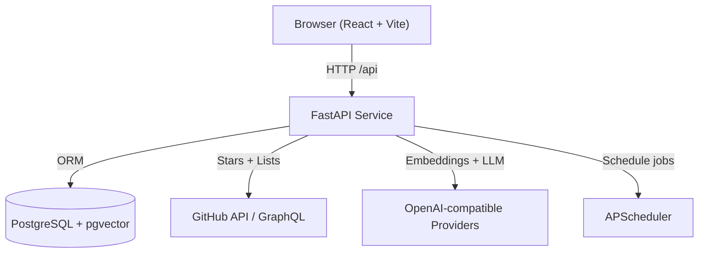
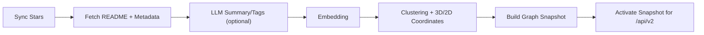

<div align="center">
  <a href="https://github.com/Tendo33/MyNebula">
    
  </a>
  <h1>MyNebula</h1>
  <p><strong>Transform your GitHub Stars into a semantic knowledge nebula.</strong></p>
  <p>
    <a href="README.zh.md">中文</a> · English
  </p>
  <p>
    
    
    
    
    
    <a href="LICENSE"></a>
  </p>
</div>

<div align="center">
  
</div>

---

## What is MyNebula

MyNebula turns your growing GitHub Stars list into a searchable, explorable, and continuously updated knowledge graph.

Instead of scrolling through hundreds of starred repositories, you get:

- semantic clusters with AI-assisted naming,
- graph exploration with timeline replay,
- related-repo recommendations with explainable signals,
- a production-oriented sync pipeline (incremental/full + schedule + snapshots).

---

## Screenshots

<div align="center">
  
  <br /><br />
  
</div>

---

## Core Capabilities

- **Semantic graph modeling**: Embeddings + clustering transform stars into topic groups.
- **Versioned graph snapshots**: Read APIs serve immutable snapshot payloads for stable UX.
- **Paged edge loading**: Large graph edges are loaded incrementally (`/api/v2/graph/edges`).
- **Incremental sync pipeline**: `stars -> embeddings -> clustering -> snapshot` with run tracking.
- **Smart reprocessing**: Description/topic hash change detection avoids unnecessary recompute.
- **Adaptive clustering strategy**: Automatic full-recluster fallback when incremental drift is high.
- **Schedule automation**: Timezone-aware periodic sync powered by APScheduler.
- **Bilingual UI**: Built-in i18n (`en`/`zh`) in frontend and configurable LLM output language.

---

## Architecture


```mermaid
graph TD
    Browser["Browser (React + Vite)"] -->|HTTP /api| FastAPI["FastAPI Service"]
    FastAPI -->|ORM| Postgres[("PostgreSQL + pgvector")]
    FastAPI -->|Stars + Lists| GitHub["GitHub API / GraphQL"]
    FastAPI -->|Embeddings + LLM| AI["OpenAI-compatible Providers"]
    FastAPI -->|Schedule jobs| APS["APScheduler"]
```


```mermaid
flowchart LR
    A["Sync Stars"] --> B["Fetch README + Metadata"]
    B --> C["LLM Summary/Tags (optional)"]
    C --> D["Embedding"]
    D --> E["Clustering + 3D/2D Coordinates"]
    E --> F["Build Graph Snapshot"]
    F --> G["Activate Snapshot for /api/v2"]
```

---

## Tech Stack

- **Backend**: FastAPI, SQLAlchemy (async), asyncpg, Alembic, APScheduler
- **Data/ML**: pgvector, NumPy, scikit-learn, custom relevance scoring
- **Frontend**: React 18, TypeScript, Vite, React Query, react-force-graph-2d, TailwindCSS
- **Infra/Tooling**: Docker Compose, uv, Ruff, Pytest, Vitest, Playwright

---

## Quick Start (Docker, Recommended)

### Prerequisites

- Docker + Docker Compose v2
- GitHub Personal Access Token
- Embedding provider API key (OpenAI-compatible)

### 1) Clone and configure

```bash
git clone https://github.com/Tendo33/MyNebula.git
cd MyNebula
cp .env.example .env
```

At minimum, update in `.env`:

- `GITHUB_TOKEN`
- `EMBEDDING_API_KEY`
- `ADMIN_PASSWORD` (strongly recommended, enables admin login)

### 2) Start services

```bash
docker compose up -d
```

### 3) Open app

- Web: <http://localhost:8000>
- Health: <http://localhost:8000/health>
- OpenAPI docs: <http://localhost:8000/docs> (`DEBUG=true` only)

### 4) First sync flow

1. Open `/settings`
2. Login with `ADMIN_USERNAME` / `ADMIN_PASSWORD`
3. Trigger **Sync Pipeline** (incremental or full)
4. Wait until snapshot phase is completed, then open `/graph`

---

## Local Development

### Backend

```bash
cp .env.example .env
uv sync --all-extras
docker compose up -d db
uv run alembic upgrade head
uv run uvicorn nebula.main:app --reload --port 8000
```

### Frontend (hot reload)

```bash
npm --prefix frontend install
VITE_API_BASE_URL=http://localhost:8000 npm --prefix frontend run dev
```

Then open <http://localhost:5173>.

> In dev mode, frontend uses `/api` proxy. If `VITE_API_BASE_URL` is not set, Vite defaults to `http://localhost:8071`.

### Backend-served frontend (single endpoint)

```bash
npm --prefix frontend run build
uv run uvicorn nebula.main:app --reload --port 8000
```

If `frontend/dist` exists, FastAPI serves the SPA and static assets directly.

---

## Configuration Overview

| Category | Key Variables | Required | Notes |
|---|---|---:|---|
| GitHub | `GITHUB_TOKEN` | ✅ | For stars/lists sync |
| Embedding | `EMBEDDING_API_KEY`, `EMBEDDING_BASE_URL`, `EMBEDDING_MODEL`, `EMBEDDING_DIMENSIONS` | ✅ | OpenAI-compatible embedding endpoint |
| LLM | `LLM_API_KEY`, `LLM_BASE_URL`, `LLM_MODEL`, `LLM_OUTPUT_LANGUAGE` | Optional | For summary/tag and cluster naming |
| Admin auth | `ADMIN_USERNAME`, `ADMIN_PASSWORD`, `ADMIN_SESSION_TTL_HOURS` | ⚠️ Recommended | If password is empty, admin-protected APIs are disabled |
| Database | `DATABASE_*` / `DATABASE_URL` | ✅ | `DATABASE_URL` overrides split fields |
| Sync | `SYNC_BATCH_SIZE`, `SYNC_README_MAX_LENGTH`, `SYNC_DEFAULT_SYNC_MODE`, `SYNC_DETECT_UNSTARRED_ON_INCREMENTAL` | Optional | Tune cost/performance behavior |
| Runtime | `DEBUG`, `API_PORT`, `SLOW_QUERY_LOG_MS`, `API_QUERY_TIMEOUT_SECONDS` | Optional | Observability + API behavior |

Full reference: `doc/ENV_VARS.md`

---

## API Quick Reference

Base prefix: `/api`

### Read endpoints (public in single-user mode)

- `GET /health`
- `GET /api/v2/dashboard`
- `GET /api/v2/graph?version=active&include_edges=false`
- `GET /api/v2/graph/edges?version=active&cursor=0&limit=1000`
- `GET /api/v2/graph/timeline?version=active`
- `GET /api/v2/data/repos`
- `GET /api/repos/{repo_id}/related`
- `POST /api/repos/search`

### Admin-protected endpoints

- `POST /api/auth/login`
- `POST /api/v2/sync/start?mode=incremental|full`
- `GET /api/v2/sync/jobs/{run_id}`
- `POST /api/v2/settings/schedule`
- `POST /api/v2/settings/full-refresh`
- `POST /api/v2/graph/rebuild`

Legacy compatibility routes under `/api/sync` are still available.

---

## Quality & Testing

### Backend

```bash
uv run ruff format
uv run ruff check --fix
uv run pytest
```

### Frontend

```bash
npm --prefix frontend run lint
npm --prefix frontend run test
npm --prefix frontend run build
```

### E2E

```bash
RUN_E2E=1 npm --prefix frontend run test:e2e
```

### Offline quality gates

```bash
uv run python scripts/evals/run_all_quality_checks.py
```

Thresholds are enforced in `doc/QUALITY_GATES.md`.

---

## Project Structure

```text
MyNebula/
├── src/nebula/
│   ├── api/                   # v1 + v2 route layer
│   ├── application/services/  # pipeline + snapshot query services
│   ├── core/                  # config, auth, embedding, llm, clustering, scheduler
│   ├── db/                    # SQLAlchemy models + session lifecycle
│   ├── domain/                # pipeline/snapshot lifecycle enums
│   └── infrastructure/        # snapshot persistence repository
├── frontend/                  # React + TypeScript SPA
├── alembic/                   # migrations
├── tests/                     # backend tests (api/core/evals)
├── scripts/                   # automation, perf, eval scripts
├── doc/                       # deployment/config/ops docs
├── docker-compose.yml
└── .env.example
```

---

## Docs Index

- Environment variables: `doc/ENV_VARS.md`
- Docker deployment: `doc/DOCKER_DEPLOY.md`
- Quality gates: `doc/QUALITY_GATES.md`
- Reset database: `doc/RESET_GUIDE.md`
- Data models guide: `doc/MODELS_GUIDE.md`
- SDK usage: `doc/SDK_USAGE.md`
- Release history: `CHANGELOG.md`

---

## Troubleshooting

- **No data in graph/data pages**
  - Ensure `GITHUB_TOKEN` and `EMBEDDING_API_KEY` are valid.
  - Run sync from `/settings` and wait for snapshot completion.
- **Cannot login in settings**
  - Set `ADMIN_PASSWORD` in `.env` and restart service.
- **`/docs` is missing**
  - Set `DEBUG=true`.
- **Frontend dev cannot reach backend**
  - Start frontend with `VITE_API_BASE_URL=http://localhost:8000`.
- **Slow large-graph response**
  - Use paged edges (`/api/v2/graph/edges`) and tune `API_QUERY_TIMEOUT_SECONDS`.

---

## Roadmap

- Richer explainability for recommendation and graph edges
- More export options (reports/snapshot export/share)
- Better multi-user/auth model beyond current single-user default
- More automated evaluation datasets and benchmark tooling

---

## Contributing & License

Issues and PRs are welcome.

- Contribution guide: `CONTRIBUTING.md`
- License: `LICENSE` (MIT)

