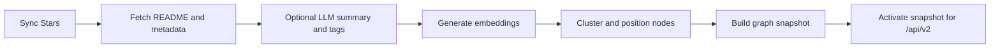

<div align="center">
  <a href="https://github.com/Tendo33/MyNebula">
    
  </a>

  <h1>MyNebula</h1>

  <p>
    <strong>Turn your GitHub Stars into a semantic knowledge nebula you can search, explore, and continuously grow.</strong>
  </p>

  <p>
    <a href="README.zh.md">中文</a> | English
  </p>

  <p>
    <a href="#quick-start">Quick Start</a>
    |
    <a href="#preview">Preview</a>
    |
    <a href="#architecture">Architecture</a>
    |
    <a href="#project-structure">Project Structure</a>
  </p>

  <p>
    
    
    
    
    
    <a href="LICENSE"></a>
  </p>

  <p>
    <a href="https://github.com/Tendo33/MyNebula/stargazers"></a>
    <a href="https://github.com/Tendo33/MyNebula/network/members"></a>
    <a href="https://github.com/Tendo33/MyNebula/issues"></a>
    <a href="https://github.com/Tendo33/MyNebula/releases"></a>
  </p>
</div>

<div align="center">
  
</div>

## Why MyNebula

GitHub Stars are useful until they become a pile.

MyNebula helps you turn that pile into a living map of what you care about: clustered by meaning, connected by similarity, and served through a graph you can actually explore. Instead of revisiting old bookmarks one by one, you get a structured view of your interests, a sync pipeline that keeps it fresh, and a frontend designed for browsing ideas rather than scrolling a list.

It is built for people who star heavily, revisit often, and want their repository collection to feel more like a knowledge space than a dumping ground.

## Table of Contents

- [Why MyNebula](#why-mynebula)
- [Table of Contents](#table-of-contents)
- [Preview](#preview)
- [Highlights](#highlights)
- [How It Works](#how-it-works)
- [Architecture](#architecture)
- [Tech Stack](#tech-stack)
- [Quick Start](#quick-start)
  - [Prerequisites](#prerequisites)
  - [1. Clone and configure](#1-clone-and-configure)
  - [2. Start the stack](#2-start-the-stack)
  - [3. Open the app](#3-open-the-app)
  - [4. Run the first sync](#4-run-the-first-sync)
- [Local Development](#local-development)
  - [Backend](#backend)
  - [Frontend](#frontend)
  - [Serve the built frontend from FastAPI](#serve-the-built-frontend-from-fastapi)
- [Configuration Overview](#configuration-overview)
- [API Quick Reference](#api-quick-reference)
  - [Read endpoints](#read-endpoints)
  - [Admin endpoints](#admin-endpoints)
- [Project Structure](#project-structure)
- [Quality and Testing](#quality-and-testing)
  - [Backend](#backend-1)
  - [Frontend](#frontend-1)
  - [E2E](#e2e)
  - [Offline quality checks](#offline-quality-checks)
- [Troubleshooting](#troubleshooting)
- [Roadmap](#roadmap)
- [Contributing](#contributing)
- [License](#license)

## Preview

MyNebula already includes a few interface assets, and the layout below is ready for you to swap in better screenshots later.

| View | Screenshot |
| --- | --- |
| Graph exploration |  |
| Repository details |  |
| Settings and scheduling |  |

Recommended screenshot set for this README:

- Graph overview with visible clusters and labels
- Repository detail page with related recommendations
- Settings page showing sync controls
- Timeline or dashboard page showing snapshot history

## Highlights

- **Semantic clustering, not manual folders**: MyNebula groups repositories by meaning so your stars become topics instead of a long flat list.
- **Graph-first exploration**: Browse your collection as an interactive nebula with node relationships, progressive edge loading, and timeline replay.
- **Snapshot-based reads**: Versioned graph snapshots keep the read experience stable while the sync pipeline continues to evolve in the background.
- **Practical sync workflow**: Incremental sync, full rebuilds, reprocessing checks, and scheduled jobs are already built in.
- **Explainable recommendations**: Related repositories are served with meaningful signals instead of opaque "you may also like" guesses.
- **Bilingual experience**: Frontend i18n and configurable LLM output language make it easier to use in both English and Chinese contexts.

## How It Works

At a high level, MyNebula turns starred repositories into a navigable knowledge graph:

1. Fetch starred repositories and metadata from GitHub.
2. Optionally enrich repositories with README-derived summaries or tags.
3. Generate embeddings for semantic similarity.
4. Cluster repositories into meaningful topic groups.
5. Build a graph snapshot with coordinates and relationships.
6. Serve that snapshot to the frontend for fast and stable exploration.

The result is a system that feels closer to a personal map of interests than a bookmark archive.

## Architecture


```mermaid
graph TD
    Browser["Browser (React + Vite)"] -->|HTTP /api| FastAPI["FastAPI Service"]
    FastAPI -->|ORM| Postgres[("PostgreSQL + pgvector")]
    FastAPI -->|Stars + Lists| GitHub["GitHub API / GraphQL"]
    FastAPI -->|Embeddings + LLM| AI["OpenAI-compatible Providers"]
    FastAPI -->|Scheduled jobs| APS["APScheduler"]
```


```mermaid
flowchart LR
    A["Sync Stars"] --> B["Fetch README and metadata"]
    B --> C["Optional LLM summary and tags"]
    C --> D["Generate embeddings"]
    D --> E["Cluster and position nodes"]
    E --> F["Build graph snapshot"]
    F --> G["Activate snapshot for /api/v2"]
```

## Tech Stack

- **Backend**: FastAPI, SQLAlchemy (async), asyncpg, Alembic, APScheduler
- **Data and ML**: pgvector, NumPy, scikit-learn, custom relevance scoring
- **Frontend**: React 18, TypeScript, Vite, React Query, react-force-graph-2d, Tailwind CSS
- **Tooling**: Docker Compose, uv, Ruff, Pytest, Vitest, Playwright

## Quick Start

### Prerequisites

- Docker and Docker Compose v2
- A GitHub Personal Access Token
- An embedding provider API key
- An LLM provider API key if you want summaries, tags, or AI-assisted naming

### 1. Clone and configure

```bash
git clone https://github.com/Tendo33/MyNebula.git
cd MyNebula
cp .env.example .env
```

At minimum, update these values in `.env`:

- `GITHUB_TOKEN`
- `EMBEDDING_API_KEY`
- `ADMIN_PASSWORD`
- `ADMIN_USERNAME` if you do not want the default `admin`

### 2. Start the stack

```bash
docker compose up -d
```

### 3. Open the app

- App: <http://localhost:8000>
- Health check: <http://localhost:8000/health>
- OpenAPI docs: <http://localhost:8000/docs> when `DEBUG=true`

### 4. Run the first sync

1. Open `/settings`
2. Log in with `ADMIN_USERNAME` and `ADMIN_PASSWORD`
3. Start the sync pipeline in `incremental` or `full` mode
4. Wait for the snapshot stage to complete
5. Open `/graph` and start exploring

## Local Development

### Backend

```bash
cp .env.example .env
uv sync --all-extras
docker compose up -d db
uv run alembic upgrade head
uv run uvicorn nebula.main:app --reload --port 8000
```

### Frontend

```bash
npm --prefix frontend install
VITE_API_BASE_URL=http://localhost:8000 npm --prefix frontend run dev
```

Then open <http://localhost:5173>.

If `VITE_API_BASE_URL` is not set, the Vite dev server defaults to `http://localhost:8071`.

### Serve the built frontend from FastAPI

```bash
npm --prefix frontend run build
uv run uvicorn nebula.main:app --reload --port 8000
```

If `frontend/dist` exists, FastAPI will serve the SPA and static assets directly.

## Configuration Overview

| Category | Key Variables | Required | Notes |
| --- | --- | --- | --- |
| GitHub | `GITHUB_TOKEN` | Yes | Used for stars and lists sync |
| Embedding | `EMBEDDING_API_KEY`, `EMBEDDING_BASE_URL`, `EMBEDDING_MODEL`, `EMBEDDING_DIMENSIONS` | Yes | OpenAI-compatible embedding endpoint |
| LLM | `LLM_API_KEY`, `LLM_BASE_URL`, `LLM_MODEL`, `LLM_OUTPUT_LANGUAGE` | Optional | Used for summaries, tags, and cluster naming |
| Admin auth | `ADMIN_USERNAME`, `ADMIN_PASSWORD`, `ADMIN_SESSION_TTL_HOURS` | Recommended | If password is empty, admin-protected APIs are disabled |
| Database | `DATABASE_*`, `DATABASE_URL` | Yes | `DATABASE_URL` overrides split database fields |
| Sync | `SYNC_BATCH_SIZE`, `SYNC_README_MAX_LENGTH`, `SYNC_DEFAULT_SYNC_MODE`, `SYNC_DETECT_UNSTARRED_ON_INCREMENTAL` | Optional | Controls throughput and cost |
| Runtime | `DEBUG`, `API_PORT`, `SLOW_QUERY_LOG_MS`, `API_QUERY_TIMEOUT_SECONDS` | Optional | Debugging and observability settings |

For the full environment reference, see `doc/ENV_VARS.md`.

## API Quick Reference

Base prefix: `/api`

### Read endpoints

- `GET /health`
- `GET /api/v2/dashboard`
- `GET /api/v2/graph?version=active&include_edges=false`
- `GET /api/v2/graph/edges?version=active&cursor=0&limit=1000`
- `GET /api/v2/graph/timeline?version=active`
- `GET /api/v2/data/repos`
- `GET /api/repos/{repo_id}/related`
- `POST /api/repos/search`

### Admin endpoints

- `POST /api/auth/login`
- `POST /api/v2/sync/start?mode=incremental|full`
- `GET /api/v2/sync/jobs/{run_id}`
- `POST /api/v2/settings/schedule`
- `POST /api/v2/settings/full-refresh`
- `POST /api/v2/graph/rebuild`

Legacy compatibility routes under `/api/sync` are still available.

## Project Structure

```text
MyNebula/
|-- src/nebula/
|   |-- api/                   # v1 + v2 route layers
|   |-- application/services/  # sync pipeline and snapshot query services
|   |-- core/                  # config, auth, embedding, llm, clustering, scheduler
|   |-- db/                    # SQLAlchemy models and session lifecycle
|   |-- domain/                # pipeline and snapshot lifecycle enums
|   `-- infrastructure/        # snapshot persistence repositories
|-- frontend/                  # React + TypeScript SPA
|-- alembic/                   # database migrations
|-- tests/                     # backend tests
|-- scripts/                   # automation, evaluation, and maintenance scripts
|-- doc/                       # deployment, config, and operations docs
|-- docker-compose.yml
`-- .env.example
```

## Quality and Testing

### Backend

```bash
uv run ruff format
uv run ruff check --fix
uv run pytest
```

### Frontend

```bash
npm --prefix frontend run lint
npm --prefix frontend run test
npm --prefix frontend run build
```

### E2E

```bash
RUN_E2E=1 npm --prefix frontend run test:e2e
```

### Offline quality checks

```bash
uv run python scripts/evals/run_all_quality_checks.py
```

Threshold details live in `doc/QUALITY_GATES.md`.

## Troubleshooting

- **The graph is empty**
  Check that `GITHUB_TOKEN` and `EMBEDDING_API_KEY` are valid, then run a sync from `/settings` and wait for snapshot completion.
- **You cannot log in**
  Set `ADMIN_PASSWORD` in `.env`, restart the service, and try again.
- **`/docs` is missing**
  Set `DEBUG=true`.
- **Frontend dev server cannot reach the backend**
  Start the frontend with `VITE_API_BASE_URL=http://localhost:8000`.
- **Large graph responses feel slow**
  Use paged edge loading through `/api/v2/graph/edges` and tune `API_QUERY_TIMEOUT_SECONDS`.

## Roadmap

- Richer explainability for recommendations and graph relationships
- Better export and sharing options for snapshots and reports
- A more complete multi-user and auth model beyond the current single-user-first setup
- Stronger evaluation datasets and benchmarking workflows

## Contributing

Issues and pull requests are welcome.

- Contribution guide: `CONTRIBUTING.md`
- Changelog: `CHANGELOG.md`

## License

Released under the MIT License. See `LICENSE`.
