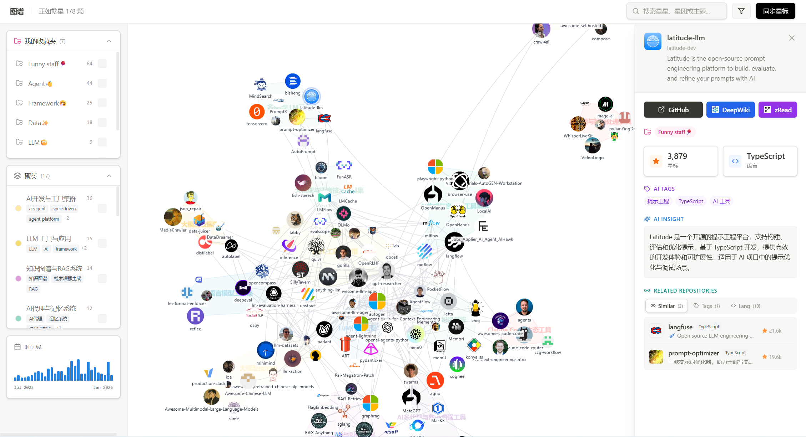
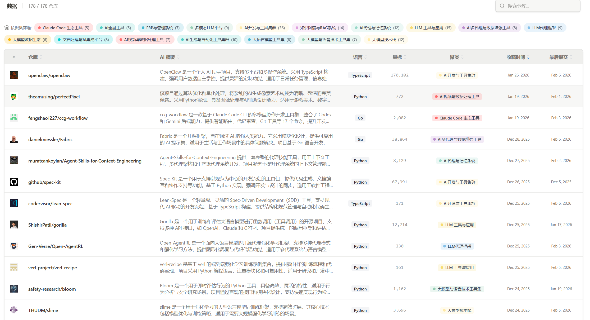
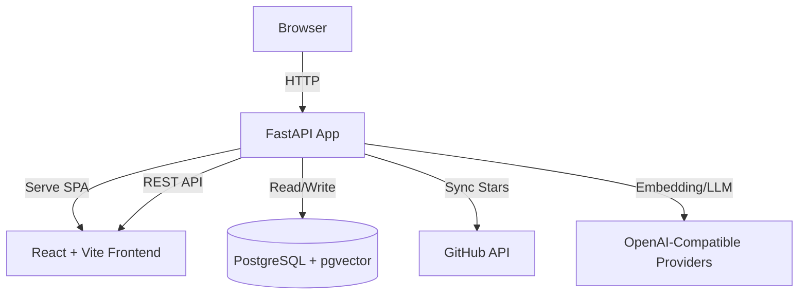

<div align="center">
  <a href="https://github.com/Tendo33/MyNebula">
    
  </a>
  <h1>MyNebula (我的星云)</h1>

  <p>
    <strong>Transform your GitHub Stars into a semantic knowledge nebula.</strong>
  </p>

  <p>
    用语义聚类 + 可视化，把“收藏夹”变成可探索、可回顾、可运营的个人技术知识图谱。
  </p>

  <p>
    <a href="README.md">English</a> | 中文
  </p>

  <p>
    <a href="#-快速开始">快速开始</a> ·
    <a href="#-本地开发">本地开发</a> ·
    <a href="#-文档索引">文档索引</a> ·
    <a href="#-常见问题">常见问题</a>
  </p>

  <p>
    <a href="https://www.python.org/downloads/"></a>
    <a href="https://fastapi.tiangolo.com/"></a>
    <a href="https://www.postgresql.org/"></a>
    <a href="https://github.com/astral-sh/uv"></a>
    <a href="https://github.com/astral-sh/ruff"></a>
    <a href="LICENSE"></a>
  </p>
</div>

<div align="center">
  
</div>

---

## 为什么是 MyNebula

GitHub Star 很容易越存越多，但真正需要回看、复用、比较时，通常会遇到这些问题：

- 收藏数量大，靠关键词很难快速定位。
- 仓库之间的语义关系看不见，难以发现“同类解法”。
- 时间维度缺失，无法回答“我最近关注了什么方向”。

MyNebula 的目标是把“仓库清单”变成“知识空间”：你不仅能找到仓库，还能理解它与其他仓库的关系、演化和上下文。

## ✨ 核心能力

- **语义图谱**：基于向量相似度构建仓库关系图，自动聚类并可视化。
- **多维筛选**：按聚类、收藏夹、时间线、关键词等快速缩小范围。
- **AI 增强**：自动生成摘要与标签，降低阅读仓库门槛。
- **时间回放**：按月份回溯 Star 变化，观察兴趣和技术轨迹。
- **同步与调度**：支持增量同步、全量刷新与定时任务。
- **可运维的设置中心**：聚类参数、同步进度、状态信息集中管理。

## 📸 界面预览

<div align="center">
  
  <br /><br />
  
</div>

---

## 🏗 技术架构



- 后端：FastAPI + SQLAlchemy + asyncpg + APScheduler
- 前端：React + TypeScript + Vite + Tailwind
- 数据：PostgreSQL 16 + pgvector
- AI：支持 SiliconFlow / OpenAI / Jina / Ollama 等 OpenAI 兼容接口

---

## 🚀 快速开始

### 方式 A：Docker Compose（推荐）

适合“开箱即用”。该方式会启动数据库和应用容器。

```bash
git clone https://github.com/Tendo33/MyNebula.git
cd MyNebula

cp .env.example .env
# 编辑 .env，至少填写 GITHUB_TOKEN 和 EMBEDDING_API_KEY

docker compose up -d
```

默认访问：

- Web: <http://localhost:8000>
- Health: <http://localhost:8000/health>

> `DEBUG=true` 时才会启用 `/docs` 和 `/redoc`。

---

## 💻 本地开发

### 环境要求

- Python 3.12+
- Node.js 20+
- Docker（用于本地 PostgreSQL）

### 1) 准备配置

```bash
cp .env.example .env
```

### 2) 启动数据库

```bash
docker compose up -d db
```

### 3) 启动后端

```bash
uv sync
uv run alembic upgrade head
uv run uvicorn nebula.main:app --reload --port 8000
```

### 4) 启动前端（可选）

前端开发服务器默认在 5173 端口；需显式指定 API 地址：

```bash
npm --prefix frontend install
VITE_API_BASE_URL=http://localhost:8000 npm --prefix frontend run dev
```

如果只想让后端统一托管前端静态文件：

```bash
npm --prefix frontend run build
# 然后访问 http://localhost:8000
```

---

## ⚙️ 关键配置项

完整配置见 `.env.example` 与 `doc/ENV_VARS.md`。常用项如下：

| 类别 | 变量 | 说明 |
|---|---|---|
| GitHub | `GITHUB_TOKEN` | 必填，用于同步 Star 与收藏夹 |
| Embedding | `EMBEDDING_API_KEY` | 必填，用于向量化 |
| LLM | `LLM_API_KEY` | 可选，用于摘要/聚类命名（推荐） |
| Admin | `ADMIN_USERNAME` / `ADMIN_PASSWORD` | 设置页管理权限 |
| Server | `API_PORT` | Web 对外端口（默认 8000） |
| App | `DEBUG` | 开启后可访问 `/docs` |

---

## 🧭 常见操作

- **首次导入**：进入 `/settings`，登录管理员后执行“同步星标”。
- **重建聚类**：在 `/settings` 调整 `max_clusters/min_clusters` 后执行“重新聚类”。
- **全量刷新**：用于模型或配置变更后重建全部处理结果（耗时且消耗额度）。
- **健康检查**：访问 `/health`，确认服务与数据库状态。

---

## 🗂 项目结构

```text
MyNebula/
├── src/nebula/              # FastAPI 应用与核心逻辑
│   ├── api/                 # API 路由
│   ├── core/                # 配置、AI、聚类、调度
│   ├── db/                  # ORM 与数据库初始化
│   └── schemas/             # Pydantic Schema
├── frontend/                # React 前端
├── alembic/                 # 数据库迁移
├── tests/                   # Python 测试
├── doc/                     # 详细文档与图片
├── docker-compose.yml
└── .env.example
```

---

## 🧪 开发与质量

```bash
# Python 格式化与检查
uv run ruff format
uv run ruff check --fix

# 后端测试
uv run pytest

# 前端构建验证
npm --prefix frontend run build
```

---

## 🛣 Roadmap（建议方向）

- 更强的跨条件查询（标签 + 时间 + 星标区间组合）
- 更细粒度的图谱解释能力（关系来源、相似度依据）
- 更完善的导出能力（列表、报告、图谱快照）

---

## ❓ 常见问题

### 1) 页面能打开，但没有数据？

先检查：

- `.env` 中 `GITHUB_TOKEN` 是否有效。
- `/settings` 是否成功执行同步。
- `/health` 是否返回 `database: connected`。

### 2) 为什么 `/docs` 打不开？

`/docs` 仅在 `DEBUG=true` 时启用。

### 3) 前端本地开发请求打到 5173 了？

请用下面方式启动前端：

```bash
VITE_API_BASE_URL=http://localhost:8000 npm --prefix frontend run dev
```

---

## 📚 文档索引

- Docker 部署：`doc/DOCKER_DEPLOY.md`
- 环境变量：`doc/ENV_VARS.md`
- 模型说明：`doc/MODELS_GUIDE.md`
- SDK 使用：`doc/SDK_USAGE.md`
- 数据重置：`doc/RESET_GUIDE.md`

---

## 🤝 贡献与许可

- 欢迎提交 Issue / PR（建议先阅读 `CONTRIBUTING.md`）
- License: [MIT](LICENSE)

如果这个项目对你有帮助，欢迎点个 Star ⭐
