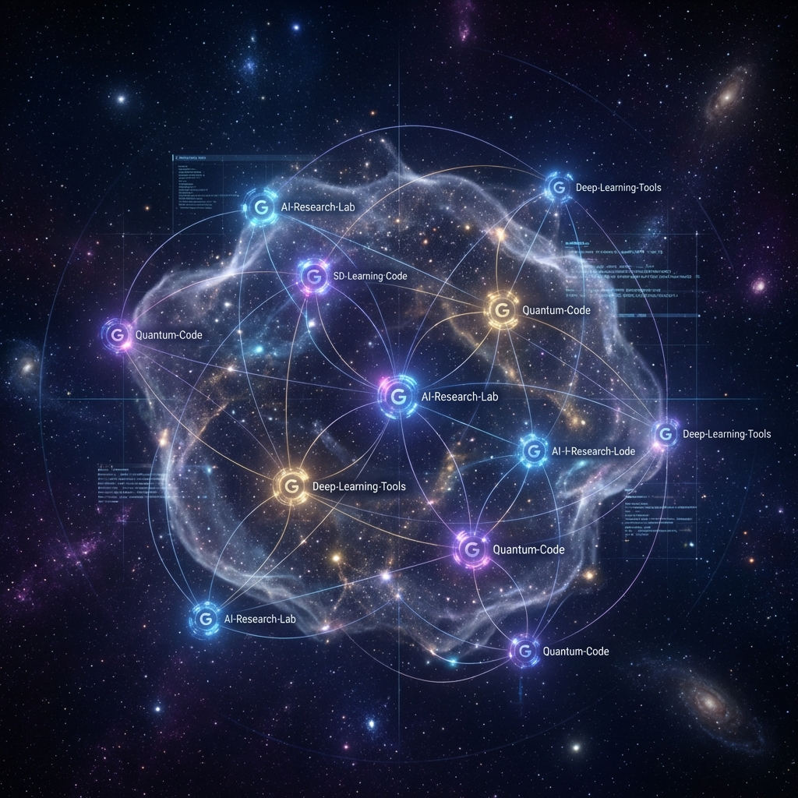
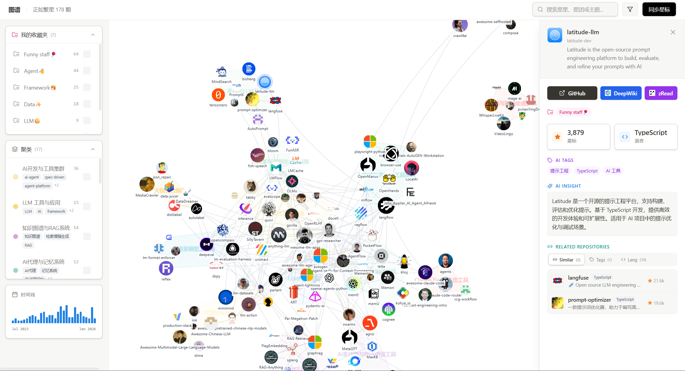
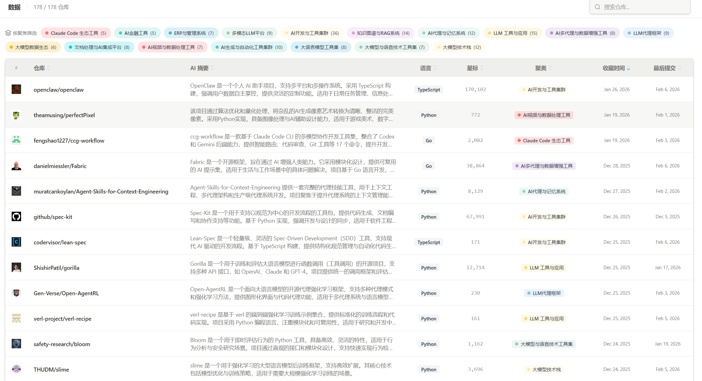
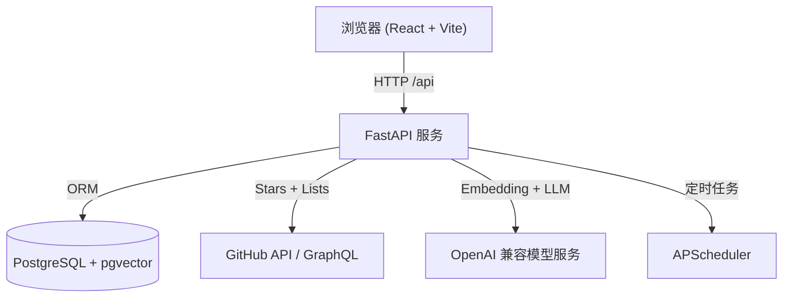
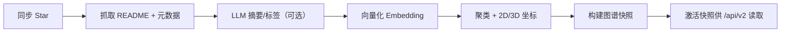

<div align="center">
  <a href="https://github.com/Tendo33/MyNebula">
    
  </a>
  <h1>MyNebula（我的星云）</h1>
  <p><strong>把你的 GitHub Stars 转化为语义化知识星云。</strong></p>
  <p>
    中文 · <a href="README.md">English</a>
  </p>
  <p>
    
    
    
    
    
    <a href="LICENSE"></a>
  </p>
</div>

<div align="center">
  
</div>

---

## MyNebula 是什么

MyNebula 将不断增长的 GitHub Star 清单，转化为可检索、可探索、可持续更新的个人知识图谱。

相比“翻收藏夹”，你可以直接获得：

- 基于语义聚类的主题分组（含 AI 命名），
- 图谱探索 + 时间线回放，
- 可解释的相关仓库推荐，
- 工程化同步流水线（增量/全量 + 定时 + 快照）。

---

## 界面预览

<div align="center">
  
  <br /><br />
  
</div>

---

## 核心能力

- **语义图谱建模**：Embedding + 聚类把 Star 仓库映射到知识主题。
- **版本化图谱快照**：读取接口基于不可变快照，前端体验更稳定。
- **边分页加载**：大图谱边集通过 `/api/v2/graph/edges` 分段拉取。
- **增量同步流水线**：`stars -> embeddings -> clustering -> snapshot` 全链路跟踪。
- **智能重处理**：基于描述/主题哈希变更检测，避免无效重算。
- **自适应聚类策略**：增量漂移过高时自动回退到全量重聚类。
- **定时自动化**：APScheduler + 时区感知的自动同步能力。
- **双语体验**：前端内置 `en/zh`，LLM 输出语言可配置。

---

## 系统架构


```mermaid
graph TD
    Browser["浏览器 (React + Vite)"] -->|HTTP /api| FastAPI["FastAPI 服务"]
    FastAPI -->|ORM| Postgres[("PostgreSQL + pgvector")]
    FastAPI -->|Stars + Lists| GitHub["GitHub API / GraphQL"]
    FastAPI -->|Embedding + LLM| AI["OpenAI 兼容模型服务"]
    FastAPI -->|定时任务| APS["APScheduler"]
```


```mermaid
flowchart LR
    A["同步 Star"] --> B["抓取 README + 元数据"]
    B --> C["LLM 摘要/标签（可选）"]
    C --> D["向量化 Embedding"]
    D --> E["聚类 + 2D/3D 坐标"]
    E --> F["构建图谱快照"]
    F --> G["激活快照供 /api/v2 读取"]
```

---

## 技术栈

- **后端**：FastAPI、SQLAlchemy (async)、asyncpg、Alembic、APScheduler
- **数据/算法**：pgvector、NumPy、scikit-learn、自定义相关性评分
- **前端**：React 18、TypeScript、Vite、React Query、react-force-graph-2d、TailwindCSS
- **工程工具**：Docker Compose、uv、Ruff、Pytest、Vitest、Playwright

---

## 快速开始（推荐 Docker）

### 前置条件

- Docker + Docker Compose v2
- GitHub Personal Access Token
- 任意 OpenAI 兼容的 Embedding 服务 API Key

### 1）克隆并配置

```bash
git clone https://github.com/Tendo33/MyNebula.git
cd MyNebula
cp .env.example .env
```

至少需要在 `.env` 中填写：

- `GITHUB_TOKEN`
- `EMBEDDING_API_KEY`
- `ADMIN_PASSWORD`（强烈建议，用于启用后台登录）

### 2）启动服务

```bash
docker compose up -d
```

### 3）访问地址

- Web：<http://localhost:8000>
- 健康检查：<http://localhost:8000/health>
- OpenAPI 文档：<http://localhost:8000/docs>（仅 `DEBUG=true`）

### 4）首次使用流程

1. 打开 `/settings`
2. 使用 `ADMIN_USERNAME` / `ADMIN_PASSWORD` 登录
3. 触发 **Sync Pipeline**（增量或全量）
4. 等待快照阶段完成后访问 `/graph`

---

## 本地开发

### 后端

```bash
cp .env.example .env
uv sync --all-extras
docker compose up -d db
uv run alembic upgrade head
uv run uvicorn nebula.main:app --reload --port 8000
```

### 前端（热更新）

```bash
npm --prefix frontend install
VITE_API_BASE_URL=http://localhost:8000 npm --prefix frontend run dev
```

然后访问 <http://localhost:5173>。

> 前端开发模式使用 `/api` 代理；若不设置 `VITE_API_BASE_URL`，Vite 默认目标为 `http://localhost:8071`。

### 后端统一托管前端静态文件

```bash
npm --prefix frontend run build
uv run uvicorn nebula.main:app --reload --port 8000
```

当 `frontend/dist` 存在时，FastAPI 会自动托管 SPA 静态资源。

---

## 配置总览

| 分类 | 关键变量 | 必需 | 说明 |
|---|---|---:|---|
| GitHub | `GITHUB_TOKEN` | ✅ | 用于 Star/列表同步 |
| Embedding | `EMBEDDING_API_KEY`, `EMBEDDING_BASE_URL`, `EMBEDDING_MODEL`, `EMBEDDING_DIMENSIONS` | ✅ | OpenAI 兼容向量接口 |
| LLM | `LLM_API_KEY`, `LLM_BASE_URL`, `LLM_MODEL`, `LLM_OUTPUT_LANGUAGE` | 可选 | 用于摘要/标签与聚类命名 |
| 管理员鉴权 | `ADMIN_USERNAME`, `ADMIN_PASSWORD`, `ADMIN_SESSION_TTL_HOURS` | ⚠️ 推荐 | 若密码为空，管理员接口不可用 |
| 数据库 | `DATABASE_*` / `DATABASE_URL` | ✅ | `DATABASE_URL` 优先级更高 |
| 同步 | `SYNC_BATCH_SIZE`, `SYNC_README_MAX_LENGTH`, `SYNC_DEFAULT_SYNC_MODE`, `SYNC_DETECT_UNSTARRED_ON_INCREMENTAL` | 可选 | 可调成本与性能策略 |
| 运行时 | `DEBUG`, `API_PORT`, `SLOW_QUERY_LOG_MS`, `API_QUERY_TIMEOUT_SECONDS` | 可选 | 影响可观测性与 API 行为 |

完整变量说明见：`doc/ENV_VARS.md`

---

## API 快速索引

统一前缀：`/api`

### 读取接口（单用户模式默认可访问）

- `GET /health`
- `GET /api/v2/dashboard`
- `GET /api/v2/graph?version=active&include_edges=false`
- `GET /api/v2/graph/edges?version=active&cursor=0&limit=1000`
- `GET /api/v2/graph/timeline?version=active`
- `GET /api/v2/data/repos`
- `GET /api/repos/{repo_id}/related`
- `POST /api/repos/search`

### 管理员保护接口

- `POST /api/auth/login`
- `POST /api/v2/sync/start?mode=incremental|full`
- `GET /api/v2/sync/jobs/{run_id}`
- `POST /api/v2/settings/schedule`
- `POST /api/v2/settings/full-refresh`
- `POST /api/v2/graph/rebuild`

`/api/sync` 下的旧接口仍保留用于兼容。

---

## 测试与质量保障

### 后端

```bash
uv run ruff format
uv run ruff check --fix
uv run pytest
```

### 前端

```bash
npm --prefix frontend run lint
npm --prefix frontend run test
npm --prefix frontend run build
```

### 端到端测试

```bash
RUN_E2E=1 npm --prefix frontend run test:e2e
```

### 离线质量门禁

```bash
uv run python scripts/evals/run_all_quality_checks.py
```

门禁阈值说明见：`doc/QUALITY_GATES.md`

---

## 项目结构

```text
MyNebula/
├── src/nebula/
│   ├── api/                   # v1 + v2 路由层
│   ├── application/services/  # 流水线与快照查询服务
│   ├── core/                  # 配置、鉴权、LLM、Embedding、聚类、调度
│   ├── db/                    # SQLAlchemy 模型与会话生命周期
│   ├── domain/                # pipeline/snapshot 生命周期枚举
│   └── infrastructure/        # 快照持久化仓储
├── frontend/                  # React + TypeScript 前端
├── alembic/                   # 数据库迁移
├── tests/                     # 后端测试（api/core/evals）
├── scripts/                   # 自动化、性能、评估脚本
├── doc/                       # 部署/配置/运维文档
├── docker-compose.yml
└── .env.example
```

---

## 文档索引

- 环境变量：`doc/ENV_VARS.md`
- Docker 部署：`doc/DOCKER_DEPLOY.md`
- 质量门禁：`doc/QUALITY_GATES.md`
- 数据重置：`doc/RESET_GUIDE.md`
- 模型说明：`doc/MODELS_GUIDE.md`
- SDK 使用：`doc/SDK_USAGE.md`
- 版本变更：`CHANGELOG.md`

---

## 常见问题

- **图谱/数据页没有内容**
  - 检查 `GITHUB_TOKEN` 和 `EMBEDDING_API_KEY` 是否有效。
  - 在 `/settings` 触发同步并等待快照构建完成。
- **设置页无法登录**
  - 请在 `.env` 中设置 `ADMIN_PASSWORD` 后重启服务。
- **`/docs` 不可访问**
  - 设置 `DEBUG=true`。
- **前端本地调试连不上后端**
  - 使用 `VITE_API_BASE_URL=http://localhost:8000` 启动前端。
- **大图谱请求较慢**
  - 优先使用 `/api/v2/graph/edges` 分页接口，并按需调大 `API_QUERY_TIMEOUT_SECONDS`。

---

## Roadmap

- 更强的推荐与图关系可解释性
- 更完善的导出能力（报告/快照导出/分享）
- 超越当前单用户模式的多用户与鉴权能力
- 更系统化的评测数据集与基准工具

---

## 贡献与许可

欢迎提 Issue / PR。

- 贡献指南：`CONTRIBUTING.md`
- 开源许可：`LICENSE`（MIT）

