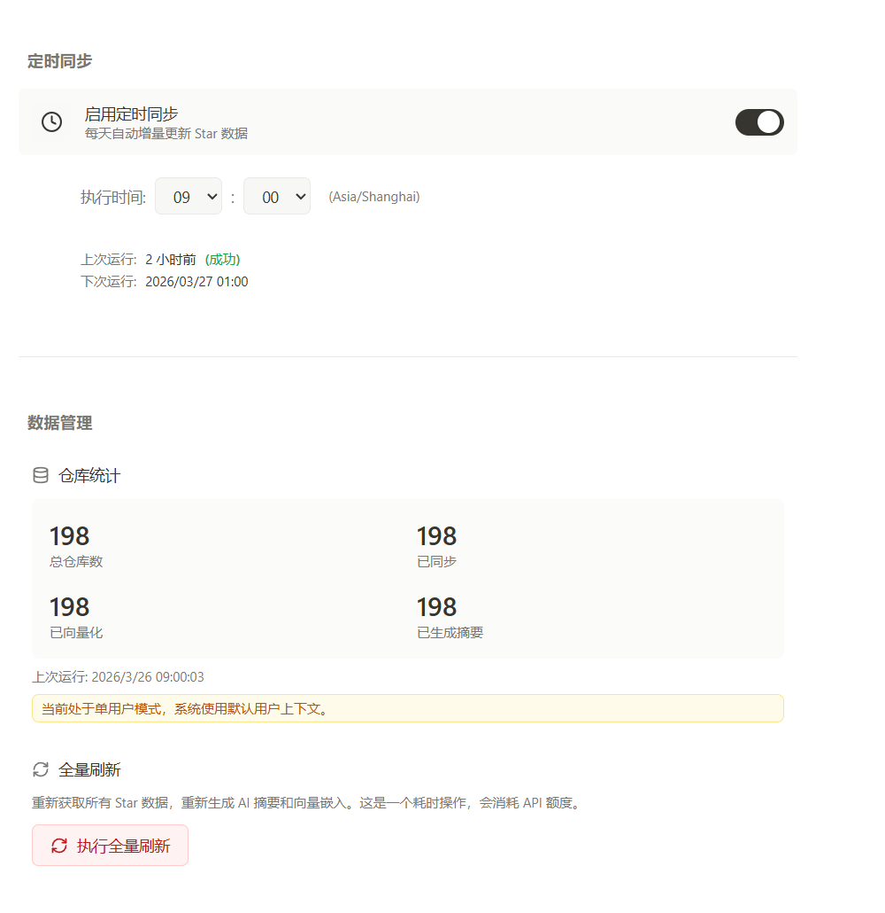
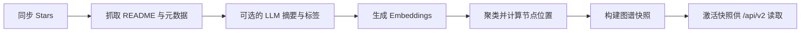

<div align="center">
  <a href="https://github.com/Tendo33/MyNebula">
    
  </a>

  <h1>MyNebula</h1>

  <p>
    <strong>把你的 GitHub Stars 变成一片可搜索、可探索、可持续生长的语义知识星云。</strong>
  </p>

  <p>
    中文 | <a href="README.md">English</a>
  </p>

  <p>
    <a href="#快速开始">快速开始</a>
    |
    <a href="#界面预览">界面预览</a>
    |
    <a href="#系统架构">系统架构</a>
    |
    <a href="#项目结构">项目结构</a>
  </p>

  <p>
    
    
    
    
    
    <a href="LICENSE"></a>
  </p>

  <p>
    <a href="https://github.com/Tendo33/MyNebula/stargazers"></a>
    <a href="https://github.com/Tendo33/MyNebula/network/members"></a>
    <a href="https://github.com/Tendo33/MyNebula/issues"></a>
    <a href="https://github.com/Tendo33/MyNebula/releases"></a>
  </p>
</div>

<div align="center">
  
</div>

## 为什么是 MyNebula

GitHub Stars 在数量少的时候很好用，数量一多就很容易变成一堆难以回看的收藏。

MyNebula 想做的，就是把这些零散的星标仓库整理成一张真正能浏览的知识地图。它会按语义把仓库聚成主题，把相似项目连接起来，再通过图谱界面把它们呈现出来。这样你不需要再一条条翻收藏记录，而是可以从更高的视角理解自己关注过什么、哪些方向彼此相关、最近又新增了哪些兴趣点。

它更适合这样一类人：经常 star、确实会回看、并且希望自己的收藏不只是“仓库列表”，而是一套可以持续积累的个人知识空间。

## 目录

- [为什么是 MyNebula](#为什么是-mynebula)
- [目录](#目录)
- [界面预览](#界面预览)
- [核心亮点](#核心亮点)
- [工作方式](#工作方式)
- [系统架构](#系统架构)
- [技术栈](#技术栈)
- [快速开始](#快速开始)
  - [前置条件](#前置条件)
  - [1. 克隆并配置](#1-克隆并配置)
  - [2. 启动服务](#2-启动服务)
  - [3. 打开应用](#3-打开应用)
  - [4. 运行首次同步](#4-运行首次同步)
- [本地开发](#本地开发)
  - [后端](#后端)
  - [前端](#前端)
  - [由 FastAPI 直接托管构建后的前端](#由-fastapi-直接托管构建后的前端)
- [配置概览](#配置概览)
- [文档地图](#文档地图)
- [API 快速参考](#api-快速参考)
  - [读取接口](#读取接口)
  - [管理接口](#管理接口)
- [项目结构](#项目结构)
- [质量与测试](#质量与测试)
  - [后端](#后端-1)
  - [前端](#前端-1)
  - [E2E](#e2e)
  - [离线质量检查](#离线质量检查)
- [常见问题](#常见问题)
- [路线图](#路线图)
- [参与贡献](#参与贡献)
- [许可证](#许可证)

## 界面预览

MyNebula 当前已经包含几张界面资源，下面这块也专门留好了截图位置，方便你后面直接替换成更正式的展示图。

| 页面 | 截图 |
| --- | --- |
| 图谱探索 |  |
| 仓库详情 |  |
| 设置与定时任务 |  |

建议最终在 README 中保留这几类截图：

- 带有聚类标签的图谱总览
- 带相关推荐的仓库详情页
- 展示同步控制的设置页
- 展示快照历史的时间线或仪表盘页面

## 核心亮点

- **不是手动分类，而是语义聚类**：MyNebula 会根据内容语义对仓库自动归组，让你的 Stars 从平面列表变成主题集合。
- **以图谱为核心的探索方式**：你可以在交互式星云图里浏览节点关系、按需加载边，并结合时间线回看演化过程。
- **基于快照的稳定读取体验**：图谱读取接口基于版本化快照，前台体验更稳，后台同步也更容易持续演进。
- **完整可用的同步流程**：增量同步、全量重建、重处理判断、定时任务这些实际使用会遇到的能力都已经考虑进去。
- **可解释的相关推荐**：相关仓库不是黑盒推荐，而是尽量基于清晰、可理解的关联信号返回结果。
- **中英文双语体验**：前端内置 i18n，LLM 输出语言可配置，适合中英文环境下使用。

## 工作方式

从整体上看，MyNebula 会把你的星标仓库逐步转换成一张可以浏览的知识图谱：

1. 从 GitHub 拉取你已加星标的仓库和相关元数据。
2. 按需读取 README，并生成摘要或标签等补充信息。
3. 为仓库生成向量表示，用于语义相似度计算。
4. 将仓库聚成更有意义的主题组。
5. 构建包含坐标和关系的图谱快照。
6. 把快照提供给前端，用更快、更稳定的方式进行展示与探索。

最终得到的不是一个收藏夹，而是一张更接近“兴趣地图”的个人知识图谱。

## 系统架构


```mermaid
graph TD
    Browser["浏览器 (React + Vite)"] -->|HTTP /api| FastAPI["FastAPI 服务"]
    FastAPI -->|ORM| Postgres[("PostgreSQL + pgvector")]
    FastAPI -->|Stars + Lists| GitHub["GitHub API / GraphQL"]
    FastAPI -->|Embeddings + LLM| AI["OpenAI 兼容模型服务"]
    FastAPI -->|Scheduled jobs| APS["APScheduler"]
```


```mermaid
flowchart LR
    A["同步 Stars"] --> B["抓取 README 与元数据"]
    B --> C["可选的 LLM 摘要与标签"]
    C --> D["生成 Embeddings"]
    D --> E["聚类并计算节点位置"]
    E --> F["构建图谱快照"]
    F --> G["激活快照供 /api/v2 读取"]
```

## 技术栈

- **后端**：FastAPI、SQLAlchemy (async)、asyncpg、Alembic、APScheduler
- **数据与算法**：pgvector、NumPy、scikit-learn、自定义相关性评分
- **前端**：React 18、TypeScript、Vite、React Query、react-force-graph-2d、Tailwind CSS
- **工程工具**：Docker Compose、uv、Ruff、Pytest、Vitest、Playwright

## 快速开始

### 前置条件

- Docker 与 Docker Compose v2
- GitHub Personal Access Token
- Embedding 服务 API Key
- 如果你希望启用摘要、标签或 AI 命名，还需要一个 LLM 服务 API Key

### 1. 克隆并配置

```bash
git clone https://github.com/Tendo33/MyNebula.git
cd MyNebula
cp .env.example .env
```

至少需要在 `.env` 中配置这些值：

- `GITHUB_TOKEN`
- `EMBEDDING_API_KEY`
- `EMBEDDING_BASE_URL`
- `EMBEDDING_MODEL`
- 如果你要启用摘要、标签或 AI 命名，还需要配置 `LLM_API_KEY`
- `ADMIN_PASSWORD`
- `ADMIN_SESSION_SECRET`
- 如果你不想使用默认值 `admin`，还需要修改 `ADMIN_USERNAME`
- `READ_ACCESS_MODE`

推荐配置：

- 本地演示：`READ_ACCESS_MODE=demo`
- 公网部署：`READ_ACCESS_MODE=authenticated`、`FORCE_SECURE_COOKIES=true`、`TRUST_PROXY_HEADERS=true`、`TRUSTED_PROXY_IPS=<反向代理 IP>`

### 2. 启动服务

```bash
docker compose up -d
```

### 3. 打开应用

- 应用地址：<http://localhost:8000>
- 健康检查：<http://localhost:8000/health>
- OpenAPI 文档：<http://localhost:8000/docs>，仅在 `DEBUG=true` 时可用

### 4. 运行首次同步

1. 打开 `/settings`
2. 使用 `ADMIN_USERNAME` 和 `ADMIN_PASSWORD` 登录
3. 选择 `incremental` 或 `full` 模式启动同步
4. 等待快照阶段完成
5. 打开 `/graph` 开始浏览

## 本地开发

### 后端

```bash
cp .env.example .env
uv sync --all-extras
docker compose up -d db
uv run alembic upgrade head
uv run uvicorn nebula.main:app --reload --port 8000
```

### 前端

```bash
npm --prefix frontend install
VITE_API_BASE_URL=http://localhost:8000 npm --prefix frontend run dev
```

然后访问 <http://localhost:5173>。

如果没有设置 `VITE_API_BASE_URL`，Vite 开发服务器默认会请求 `http://localhost:8000`。

### 由 FastAPI 直接托管构建后的前端

```bash
npm --prefix frontend run build
uv run uvicorn nebula.main:app --reload --port 8000
```

如果 `frontend/dist` 存在，FastAPI 会直接托管 SPA 与静态资源。

## 配置概览

| 分类 | 关键变量 | 必需 | 说明 |
| --- | --- | --- | --- |
| GitHub | `GITHUB_TOKEN` | 是 | 用于同步 Stars 与列表 |
| Embedding | `EMBEDDING_API_KEY`, `EMBEDDING_BASE_URL`, `EMBEDDING_MODEL`, `EMBEDDING_DIMENSIONS` | 是 | OpenAI 兼容的向量接口 |
| LLM | `LLM_API_KEY`, `LLM_BASE_URL`, `LLM_MODEL`, `LLM_OUTPUT_LANGUAGE` | 可选 | 用于摘要、标签与聚类命名 |
| 管理员认证 | `ADMIN_USERNAME`, `ADMIN_PASSWORD`, `ADMIN_SESSION_SECRET`, `ADMIN_SESSION_TTL_HOURS` | 推荐 | 如果密码或 session secret 为空，受保护接口会被禁用 |
| 数据库 | `DATABASE_*`, `DATABASE_URL` | 是 | `DATABASE_URL` 会覆盖拆分配置 |
| 同步 | `SYNC_BATCH_SIZE`, `SYNC_README_MAX_LENGTH`, `SYNC_DEFAULT_SYNC_MODE`, `SYNC_DETECT_UNSTARRED_ON_INCREMENTAL` | 可选 | 控制吞吐量与成本 |
| 运行时 | `DEBUG`, `API_PORT`, `SLOW_QUERY_LOG_MS`, `API_QUERY_TIMEOUT_SECONDS` | 可选 | 调试、日志与可观测性相关配置 |

完整环境变量与运维说明见 `ai_docs/current/operations.md`。

## 文档地图

- `ai_docs/START_HERE.md`：主文档入口
- `ai_docs/INDEX.md`：按任务导航的索引
- `ai_docs/current/operations.md`：部署、环境变量、认证、代理与重置
- `ai_docs/current/backend.md`：后端实现与服务边界
- `ai_docs/current/frontend.md`：前端实现与页面/数据边界
- `ai_docs/current/scripts.md`：维护脚本与评估工具
- `ai_docs/current/release.md`：CI 与发布流程总览
- `ai_docs/reference/verification.md`：本地验证、CI 门禁与文档链接检查

## API 快速参考

统一前缀：`/api`

### 读取接口

- `GET /health`
- `GET /api/v2/dashboard`
- `GET /api/v2/graph?version=active&include_edges=false`
- `GET /api/v2/graph/edges?version=active&cursor=0&limit=1000`
- `GET /api/v2/graph/timeline?version=active`
- `GET /api/v2/data/repos`
- `GET /api/repos/{repo_id}/related`
- `POST /api/repos/search`

### 管理接口

- `POST /api/auth/login`
- `POST /api/v2/sync/start?mode=incremental|full`
- `GET /api/v2/sync/jobs/{run_id}`
- `POST /api/v2/settings/schedule`
- `POST /api/v2/settings/full-refresh`
- `POST /api/v2/graph/rebuild`

`/api/sync` 下的旧接口目前仍保留以兼容旧版本。

当前接口契约补充说明：

- `/api/v2/data/repos` 现在会直接返回轻量 cluster 元数据和 `total_repos`，Data 页不再额外请求 graph snapshot。
- `/api/v2/dashboard` 现在直接返回 summary、top languages、top topics 和 top clusters；活动图仍单独读取 timeline。
- Data、Graph 和 Command Palette 已统一使用同一套字面搜索字段与 `stars:>N` 语法。

## 项目结构

```text
MyNebula/
|-- src/nebula/
|   |-- api/                   # v1 + v2 路由层
|   |-- application/services/  # 同步流水线与快照查询服务
|   |-- core/                  # 配置、认证、embedding、llm、聚类、调度
|   |-- db/                    # SQLAlchemy 模型与 session 生命周期
|   |-- domain/                # pipeline 与 snapshot 生命周期枚举
|   `-- infrastructure/        # 快照持久化仓储
|-- frontend/                  # React + TypeScript SPA
|-- alembic/                   # 数据库迁移
|-- tests/                     # 后端测试
|-- scripts/                   # 自动化、评估与维护脚本
|-- ai_docs/                   # 主文档系统
|-- doc/                       # 兼容页与 README 图片资源
|-- docker-compose.yml
`-- .env.example
```

## 质量与测试

### 后端

```bash
uv sync --all-extras
uv run ruff format
uv run ruff check --fix
uv run pytest
```

如果当前环境不能写默认 uv cache，可以改成：

```bash
UV_CACHE_DIR=.uv-cache uv run pytest
```

### 前端

```bash
npm --prefix frontend run lint
npm --prefix frontend run test
npm --prefix frontend run build
```

### E2E

```bash
RUN_E2E=1 npm --prefix frontend run test:e2e
```

### 离线质量检查

```bash
uv run python scripts/evals/run_all_quality_checks.py
```

质量门禁与验证命令说明见 `ai_docs/reference/verification.md`。

## 常见问题

- **图谱为空**
  请先确认 `GITHUB_TOKEN` 和 `EMBEDDING_API_KEY` 有效，然后在 `/settings` 中执行一次同步，并等待快照构建完成。
- **无法登录**
  请在 `.env` 中设置 `ADMIN_PASSWORD`，重启服务后再试。
- **`/docs` 打不开**
  请设置 `DEBUG=true`。
- **前端开发环境无法连接后端**
  请使用 `VITE_API_BASE_URL=http://localhost:8000` 启动前端。
- **大图谱加载偏慢**
  优先使用 `/api/v2/graph/edges` 的分页边加载方式，并按需调整 `API_QUERY_TIMEOUT_SECONDS`。

## 路线图

- 提升推荐结果与图谱关系的可解释性
- 增加快照与报告的导出、分享能力
- 在当前偏单用户的基础上，完善多用户与鉴权模型
- 构建更系统的评测数据集与 benchmark 工作流

## 参与贡献

欢迎提交 Issue 和 Pull Request。

- 贡献指南：`CONTRIBUTING.md`
- 更新日志：`CHANGELOG.md`

## 许可证

本项目基于 MIT License 发布，详见 `LICENSE`。
